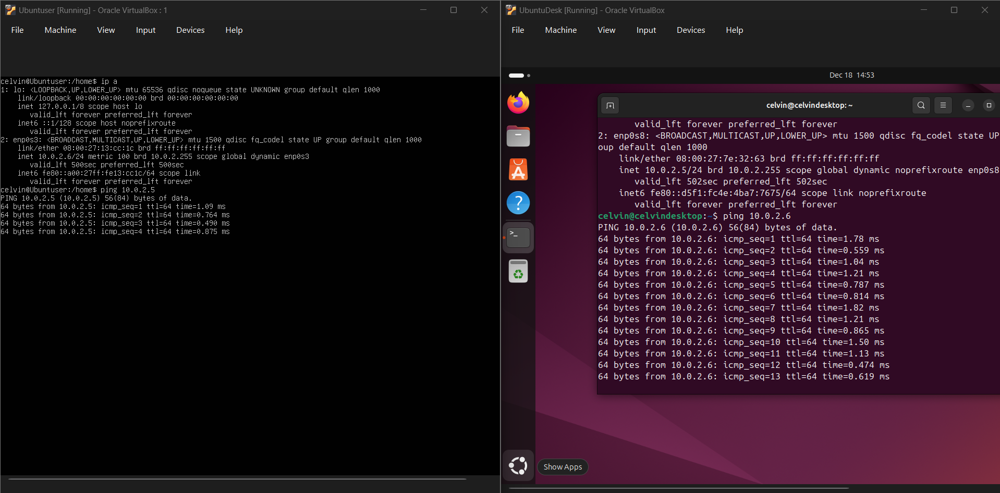

# week 2  Security Planning and Testing Methodology

# Introduction

Phase 2 focuses on planning how the system will be secured and how its performance will be tested later in the project. Before making any changes to the server, it is important to define a clear security baseline and a consistent testing approach so that results can be measured accurately.

This section explains the planned performance testing methodology, including how the server will be monitored remotely from the workstation to reduce any impact on system performance. It also outlines a security configuration checklist covering key areas such as SSH hardening, firewall configuration, access control, automatic updates, user permissions, and basic network security.

In addition, a threat model is used to identify realistic security risks that could affect the system. For each threat, suitable mitigation strategies are proposed to guide the security decisions made in later phases. This planning stage helps ensure that security and performance are considered together throughout the rest of the coursework.

# Ping Test 

  
