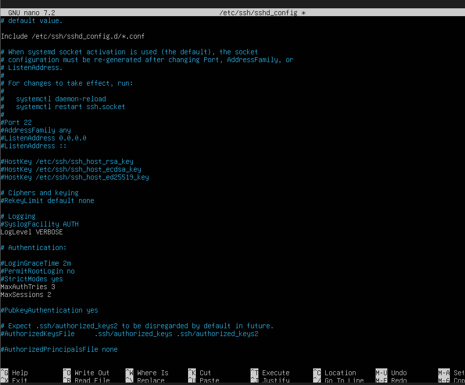

# week 4  Initial System Configuration & Security Implementation

#   Introduction

Phase 4 marks the transition from planning to practical implementation. In this phase, the server is deployed and configured with essential security controls to allow safe and controlled remote administration. The focus is on establishing a secure baseline while maintaining full command-line access from the workstation.

This section documents the configuration of SSH using key-based authentication, the setup of a firewall that restricts SSH access to a single trusted workstation, and the creation of a non-root administrative user with appropriate privileges. These steps reduce the attack surface of the system and align with common security best practices for Linux servers.

All configuration tasks are performed remotely via SSH in line with the administrative constraints of the coursework. Evidence of successful remote access, configuration changes, firewall rules, and command execution is provided through terminal output and screenshots. This phase establishes a secure and functional environment that will be extended with additional security controls and monitoring in later stages of the project.

# SSH Configuration and Access Control

Covers SSH key-based authentication, disabling password login, and verifying successful SSH access from the workstation. 

This is how the SSH looked before 
  

# Firewall Configuration

Documents firewall rules that restrict SSH access to a single trusted workstation and shows the complete ruleset.

# User and Privilege Management

Details the creation of a non-root administrative user and the configuration of sudo privileges.

# Remote Administration and Configuration Evidence

Includes before-and-after configuration file comparisons and evidence of commands executed remotely via SSH.
