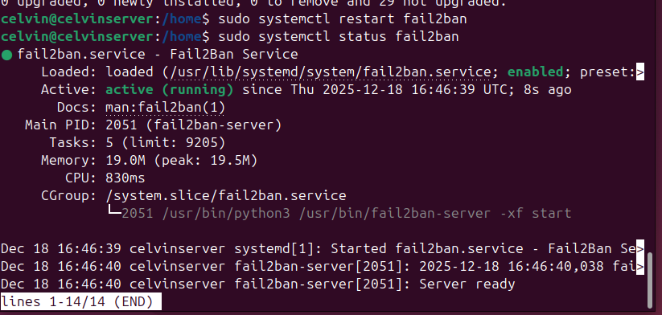

# week 5  Advanced Security and Monitoring Infrastructure 

# Introduction

Phase 5 focuses on improving the security of the server and setting up basic monitoring to observe how the system behaves over time. This phase builds on the security controls introduced earlier and aims to make the system more resistant to common attacks while allowing its performance to be monitored remotely.

In this section, access control is implemented using SELinux or AppArmor, and automatic security updates are configured to keep the system up to date. Fail2ban is also set up to help detect and block repeated unauthorised login attempts. Alongside these controls, two scripts are created: one to verify that all security settings are correctly applied on the server, and another to monitor system performance remotely from the workstation using SSH.

All scripts are fully commented and demonstrated to show how they work and why they are used. This phase helps ensure the system is both secure and observable before moving on to detailed performance testing.

# Installation document 
``` bash

##installation documentation.

sudo apt update && sudo apt install unattended-upgrades -y

## configuration

sudo dpkg-reconfigure -plow unattended-upgrades


## verification can be done using.

cat /etc/apt/apt.conf.d/50unattended-upgrades | grep "security"

```
# Intrution Detection 
``` bash

#intrustion detection

sudo apt install fail2ban -y

# we create a copy so that we dont damage the main configuration file.
sudo cp /etc/fail2ban/jail.conf /etc/fail2ban/jail.local


```
  


# Security basline script 

``` bash
#!/usr/bin/env bash
# Server hardening verification script

CONFIG_SSH="/etc/ssh/sshd_config"
AUTO_UPGRADES="/etc/apt/apt.conf.d/20auto-upgrades"
TRUSTED_IP="10.0.2.6"

print_header() {
    echo
    echo "==== $1 ===="
}

print_result() {
    local status="$1"
    local message="$2"

    if [[ "$status" == "ok" ]]; then
        echo "  [+] OK: $message"
    else
        echo "  [-] ERROR: $message"
    fi
}

echo "Starting Security Compliance Check"

print_header "SSH Settings Review"

grep -Eqs '^[[:space:]]*PasswordAuthentication[[:space:]]+no' "$CONFIG_SSH" \
    && print_result ok "SSH password authentication is disabled" \
    || print_result fail "SSH password authentication is enabled"

grep -Eqs '^[[:space:]]*PermitRootLogin[[:space:]]+no' "$CONFIG_SSH" \
    && print_result ok "Root login over SSH is blocked" \
    || print_result fail "Root login over SSH is permitted"

print_header "Firewall Status"

if ufw status | grep -q "Status: active"; then
    print_result ok "UFW firewall is running"

    ufw status | grep -Eq "22/tcp.*ALLOW.*$TRUSTED_IP" \
        && print_result ok "SSH access restricted to trusted host" \
        || print_result fail "SSH firewall restriction missing or incorrect"
else
    print_result fail "UFW firewall is not enabled"
fi

print_header "System Protection Services"

systemctl is-active --quiet fail2ban \
    && print_result ok "fail2ban service is active" \
    || print_result fail "fail2ban service is not running"

aa-status --enabled &>/dev/null \
    && print_result ok "AppArmor enforcement is enabled" \
    || print_result fail "AppArmor is disabled"

[[ -f "$AUTO_UPGRADES" ]] \
    && print_result ok "Unattended upgrades are configured" \
    || print_result fail "Automatic updates configuration not found"

echo
echo "==== Security Audit Finished ===="

```
# Remote Monitoring Script 
#!/usr/bin/env bash
# remote-healthcheck.sh
# Lightweight remote system status collector

REMOTE_USER="admin"
REMOTE_HOST="10.0.2.6"

banner() {
    echo
    echo "==== $1 ===="
}

echo "Initiating Remote Health Check"
echo "Target host: ${REMOTE_USER}@${REMOTE_HOST}"

ssh "${REMOTE_USER}@${REMOTE_HOST}" bash << 'EOF'
show_section() {
    echo
    echo ">> $1"
}

show_section "Uptime and Load Average"
uptime

show_section "Memory Consumption"
free -h

show_section "Root Filesystem Usage"
df -h /

show_section "Highest CPU Consumers"
ps -eo pid,comm,%cpu --sort=-%cpu | head -n 6
EOF

echo
echo "Remote Monitoring Session Ended"
