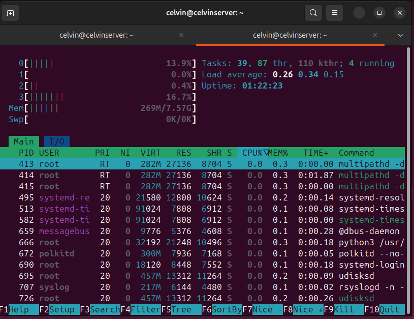
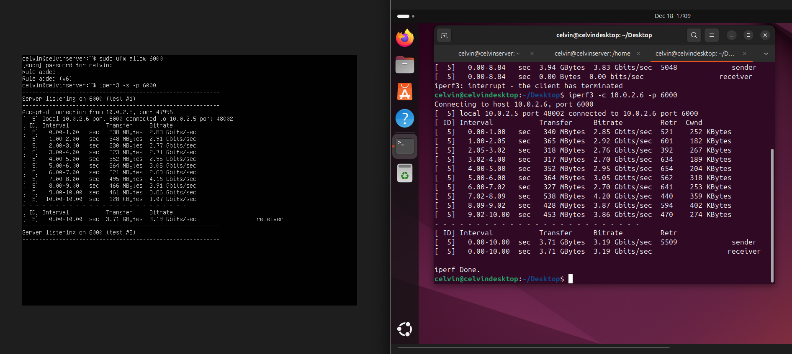

# week 6 Performance Evaluation and Analysis

# Introduction

Phase 6 focuses on testing the performance of the server and observing how the operating system behaves under different workloads. The aim is to measure how system resources are used and to identify any performance limitations.

In this phase, each selected application is tested using baseline and load testing scenarios. Metrics such as CPU usage, memory usage, disk activity, network performance, and response times are monitored and compared. The results are recorded in tables and shown using charts and graphs to make the data easier to understand.

Based on the findings, performance bottlenecks are identified and optimisation changes are applied. The system is then tested again to measure any improvements. This phase provides clear evidence of how configuration changes affect overall system performance.

# Testing Tools

Stress-ng is a system stress-testing tool used to load CPU, memory, disk, and other resources to evaluate system stability under pressure.
iperf3 measures network performance by testing bandwidth, latency, and throughput between two hosts.
dd is a low-level Unix utility used for raw data copying, often for disk benchmarking, backups, and data wiping.

## 1. CPU stress
``` bash
sudo apt update
sudo apt install stress-ng

# stress command :

stress-ng --cpu 2 --timeout 120s

```

This screenshot shows the system during a CPU performance test. The monitoring output indicates increased CPU activity while memory usage remains relatively low. This confirms that the workload is primarily CPU-intensive and allows observation of how the operating system schedules processes under load.

  

# RAM

These screenshots show the system during a memory stress test using stress-ng. The output from the monitoring tool indicates that memory usage increases significantly while the test is running, confirming that the system RAM is being heavily utilised. This demonstrates how the operating system manages memory under load and helps identify any performance impact caused by high memory usage.

  

  

# Network throughput test
This network throughput test uses iperf3 to measure the network speed between the workstation and the server. The server listens for incoming traffic while the workstation sends data to it. The results show the transfer speed in megabits per second, confirming that the network connection is working correctly.

  

# System Performance Optimisation

Improving system performance starts with understanding how the system is actually being used. For CPU performance, the focus was on checking whether any processes were causing bottlenecks and making sure the available cores were being used effectively. Monitoring tools were used to observe CPU behaviour under load and identify any unnecessary strain on the system.

Memory performance was improved by monitoring RAM usage and reducing excessive swapping, which can slow the system down. Adjusting memory settings helped ensure that applications relied more on physical memory rather than swap, especially during heavy workloads.

Disk performance was analysed by observing read and write activity during testing. Configuration changes were made to reduce unnecessary disk operations, and the impact of storage speed on overall performance was considered.

Network performance was tested by measuring latency and throughput between systems. These tests helped confirm whether the network was performing as expected and whether any tuning was needed to improve data transfer reliability.

System-level tuning involved reviewing active services and disabling anything that was not required. This reduced background resource usage and helped the system focus on the workloads being tested. Monitoring tools were used throughout to ensure the system remained stable.

Finally, performance testing tools were used to stress the system and measure the impact of changes. By comparing results before and after optimisation, it was possible to confirm whether the adjustments made had a positive effect on overall system performance.
