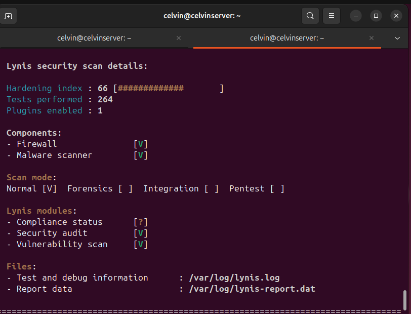
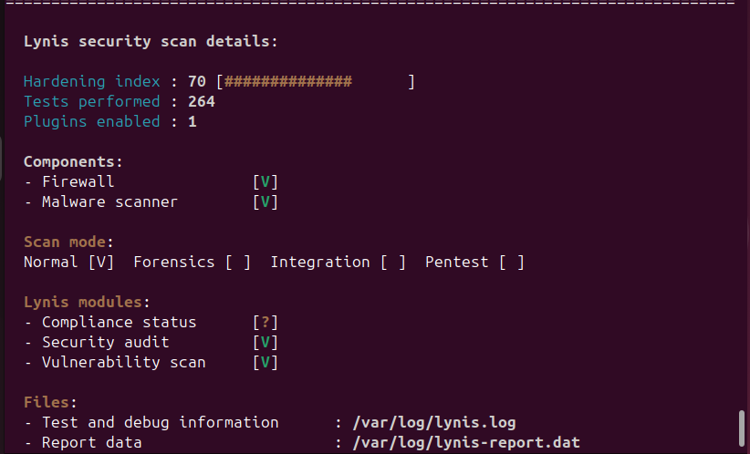
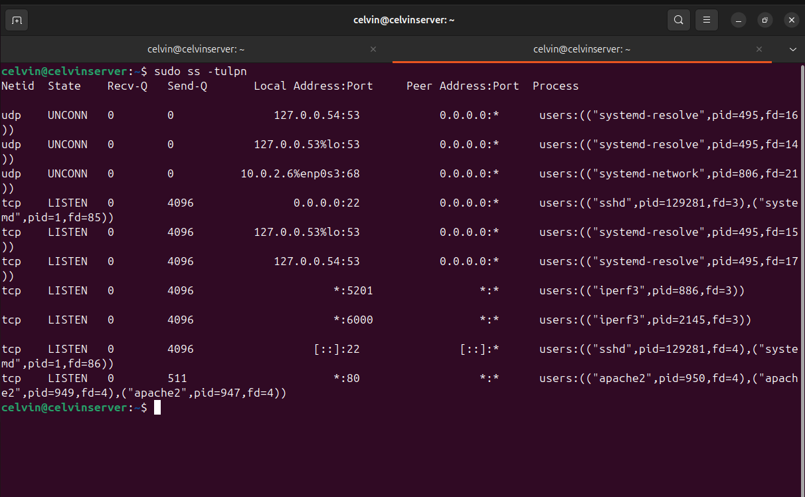

# week 7 Security Audit and System Evaluation

# Introduction 
Phase 7 focuses on reviewing the security of the system after all configuration and testing has been completed. The aim is to check how secure the server is and to see if there are any remaining issues that need attention.

In this phase, security scans are run using Lynis and network checks are carried out with nmap to see what is visible from the outside. SSH settings, access control, and running services are also reviewed to make sure they are set up correctly and that only necessary services are enabled.

The findings from these checks are documented in a security audit report, along with any improvements made and a discussion of remaining risks. This final phase helps to evaluate the overall security of the system and reflect on what has been learned during the project.

# Security scanning with Lynis:
Lynis was used to scan the system for security weaknesses and misconfigurations. It provides a security score and recommendations for improving the system.

This was the results before
  

This is the results after 
  
  
# Network security assessment with nmap:
nmap was used to scan the server from the workstation to identify open ports and active network services. This helped confirm that only required services were accessible and that the firewall rules were working as intended.

# Access control verification:
Access control settings were reviewed to ensure that user permissions, SSH access, and security policies were correctly enforced. This check confirmed that only authorised users could access the system and perform administrative tasks.

# Service audit:
All running services were reviewed to identify which services were active on the server. Each service was assessed to confirm that it was necessary for system operation, helping reduce the attack surface by disabling unused services.

# System configuration review:
The overall system configuration was reviewed to ensure security settings were applied correctly and consistently. This included checking system services, network settings, and security configurations to confirm they followed best practices.

# Active Network Services and Listening Ports

This screenshot shows the output of the ss -tulpn command, which lists all active network connections and listening ports on the server. It displays which services are currently running, the ports they are listening on, and the processes associated with them, such as SSH, Apache, and iperf3. This helps identify which services are exposed on the network and supports the service audit by confirming that only required services are active.

  
